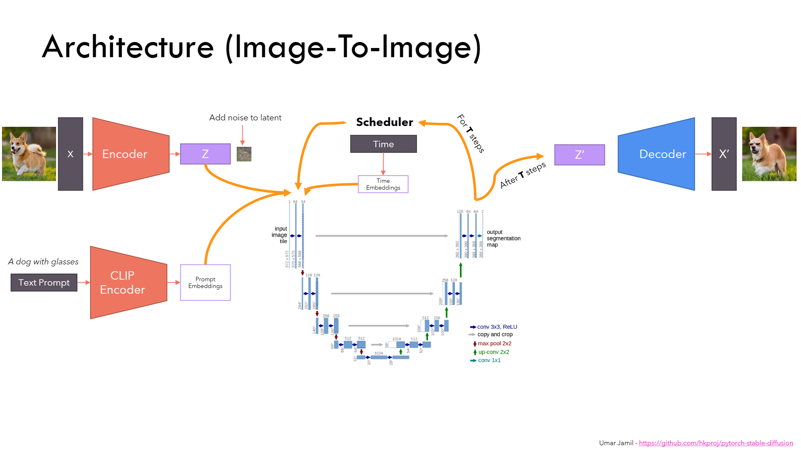
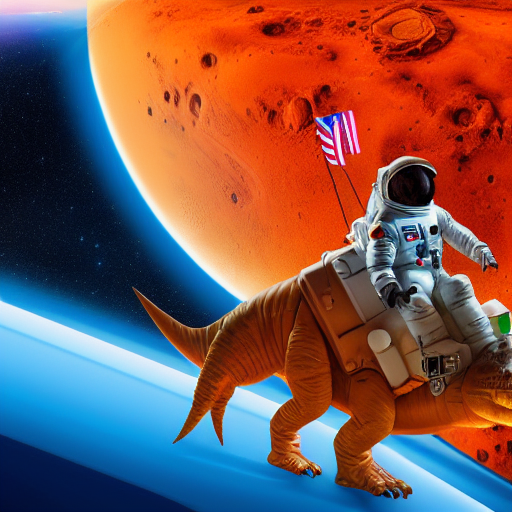
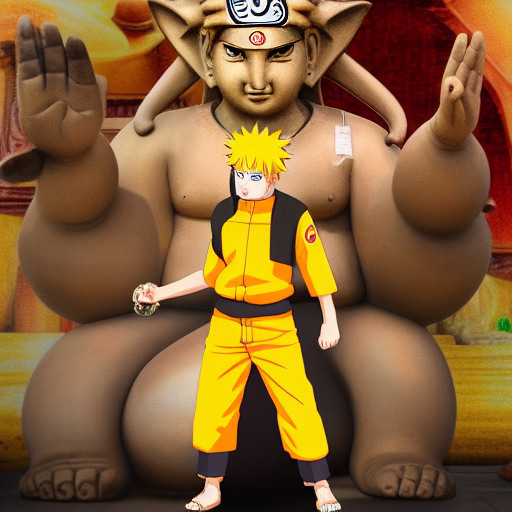
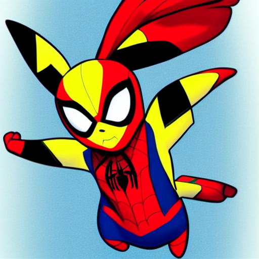
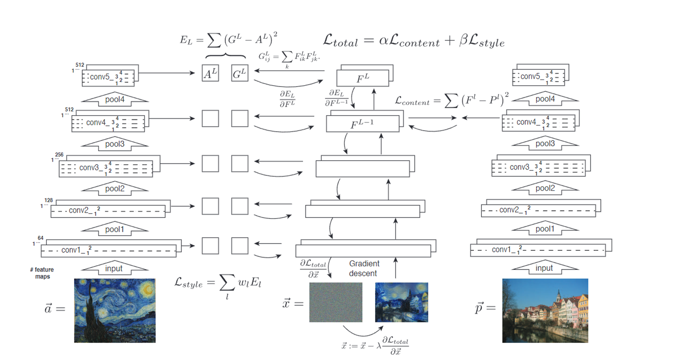
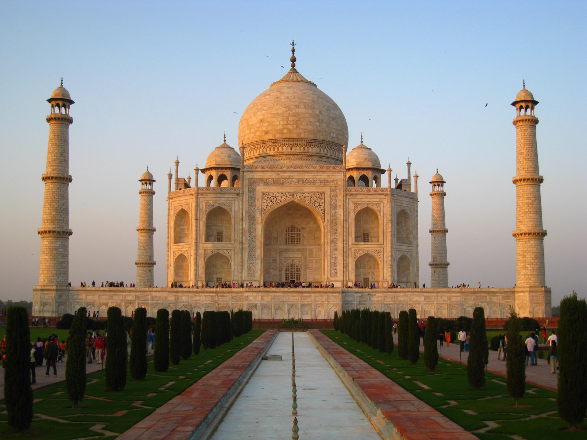
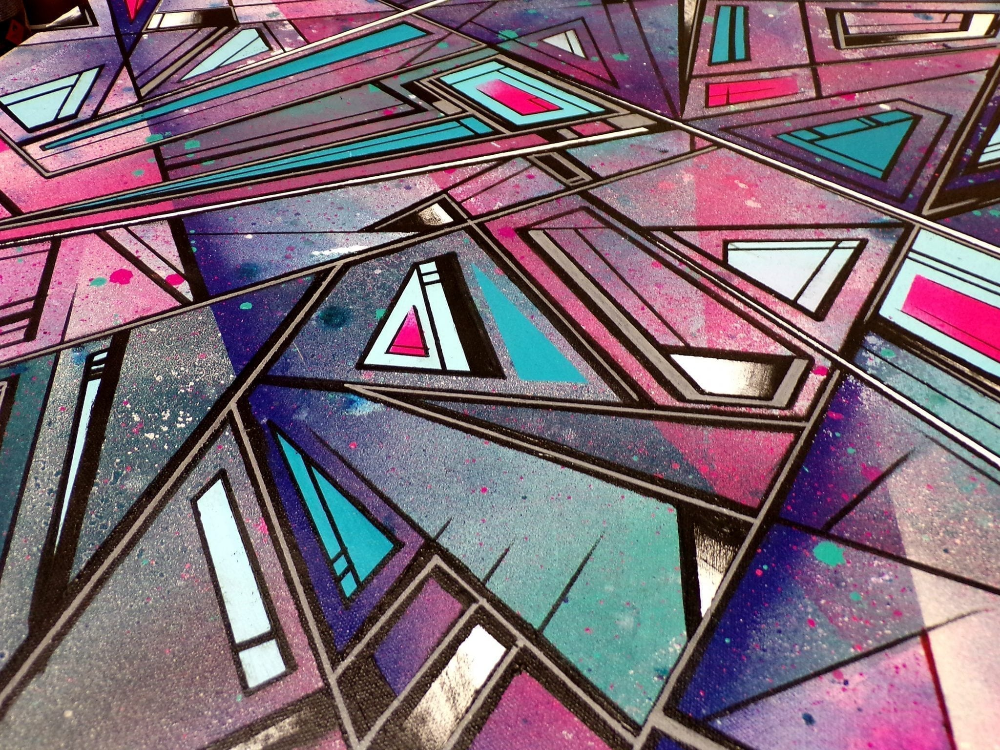
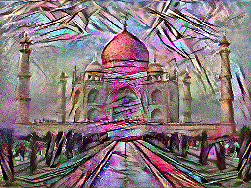

# Generative-Models

Stable Diffusion:

Uses VAE encoder-decoder architecture to reduce image size for computational purposes during training and inference. After the encoder, the data is passed to a UNET which determines how much noise needs to be removed from the image to generate a new image. Attention mechanism is used to correlate text prompts to images. demo.ipynb has a variable "cfg_scale" which determines how much the generated images should follow the prompt. To run, change the prompt and negative prompt variable in demo.ipynb and make sure the prompt has less than the max 77 tokens.

Algorithm:

Examples:

  

Style Transfer:

Implements algorithm from paper: A Neural Algorithm of Artistic Style https://arxiv.org/pdf/1508.06576v2

Takes a source image and recreates it in a specific artistic style. 
Algorithm:

Examples:

Source image:

Content image:

Style Transfer:

